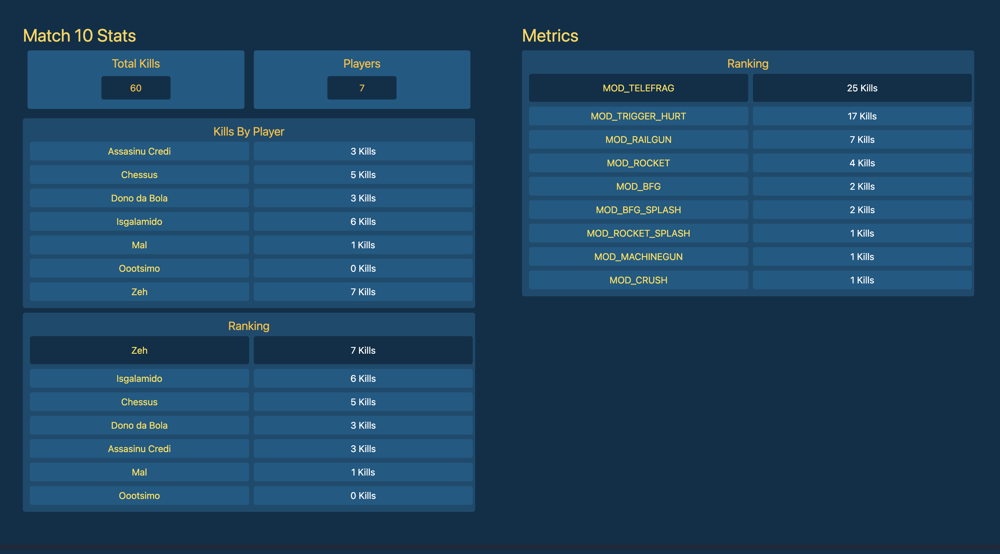

# Quake Log Stats 



## Description
This program consists of a CLI that parses a Quake 3 Arena log file and generates a data file with the following information for each game:
- Total kills
- Players
- Kills by means
- Kills by players

and a report in HTML format with the following information for each game:
- Total kills
- Players
- Kills by means
- Kills by players
- Players ranking based on kills

You can find samples of the generated files in the `samples` folder.

The report will also be printed in the terminal.

## How to run

### Go run
To run the CLI just run the command `go run . file <log_file_name>` in the root of the project.

Example:
```bash
go run . -file games.log
```

### Go build
Run the command `go build .` in the root of the project and then run the generated binary.